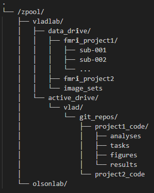

# Getting started on the workstation

## Welcome to ARTOO

Artoo is the vlad and olson lab shared work station. 

It contains a 96 core AMD Threadripper CPU, 2 NVIDIA RTX 6000 Ada GPUs, and 512 GB of memory

contact info: vayzenb@temple.edu

## Connecting to the Artoo

Using a terminal:
ssh your_tuid@cla19779.tu.temple.edu

e.g., ssh tuc66980@cla19779.tu.temple.edu

To connect from off-campus, first request Temple VPN access via TUHelp

See workflow recommendations below

### Organization of the workstation

Artoo is split into **/zpool/vladlab** and **/zpool/olsonlab** directories

Within each lab directory is a **data_drive** and a **active_drive** folder. 

The **data_drive** is intended to be primarily a read-only drive that stores large data files that are frequently read, but not modified, such as MRI data.
The **active_drive** is intended to support data and tasks that are frequently updated, such as analysis scripts. 

This split into data and active drives is designed optimize back up schedules for different data types so that the backups don't take up too much space. 

Each drive is backed up on a regular basis using different schedules. Because **data_drive** files should change less frequently, backups are made less regularly but are stored over longer periods (weekly/monthly/yearly).  By contrast, because **active_drive** files may change many times a day, these files are backed up more regularly, but stored for shorter periods of time (hourly/daily/weekly). 

See below for an example file structure for a hypothetical fMRI study 'project1'. The raw and preprocessed fMRI data would be stored in data_drive, ideally in [BIDS format](https://bids.neuroimaging.io/index.html), and the code for analyzing the data would be stored in personal folder in active_drive, ideally in a folder that syncs to [github](https://docs.github.com/en/get-started/git-basics).

Note, these are just recommendedations given typical backup needs. There are no hard constraint on which files can go where.

### Programs already installed on the workstation

Coding: anaconda, Matlab_R2025a, R 

MRI: FSL, Freesurfer 8.0.0 & 7.4.1*, AFNI, ANTS, wb_workbench

*By default, version 8.0.0 of freesurfer is the one loaded at startup for each user. Talk to vlad if you need a different version or need to be able to switch between versions

### Managing different packages and coding libraries

Different tasks may require different code libraries or packages. Each might have their own dependancies and installing too many of these in the same place can cause them to interfere with eachother. 

To address this, the workstation has [anaconda](https://docs.conda.io/projects/conda/en/stable/user-guide/cheatsheet.html) installed system wide. Anaconda allows users to create seperate coding environments for differnt where packages or libraries can be installed. For example, you may want one environment for fmri analysis packages (e.g., fmriprep, nilearn), machine learning (e.g., pytorch scikit-learn), or to try out a some risky looking code base that might otherwise break everything.

### Recommendations

The best way to work on Artoo is via the terminal or VSCode.

To work remotely using VSCode do:
1. Download chrome remote desktop: https://remotedesktop.google.com/
2. Hit ctrl/cmd + shift + P and start typing  Remote-SSH: Connect to Host
3. Plug in your connection info (e.g., tuc66980@cla19779.tu.temple.edu)

Sometimes we want to browse through the files from our comptuer without using the terminal. 

To mount artoo on PCs: 
1. install https://github.com/winfsp/sshfs-win
2. Right click on ThisPC and select "map network"
3. Select a drive and paste: \\sshfs\tuc66980@cla19779.tu.temple.edu\..\..\zpool\

To mount artoo on macs:
1. ask someone with a mac to figure it out...

I also highly recommend you organize your code into git hub repositories, or repos.

